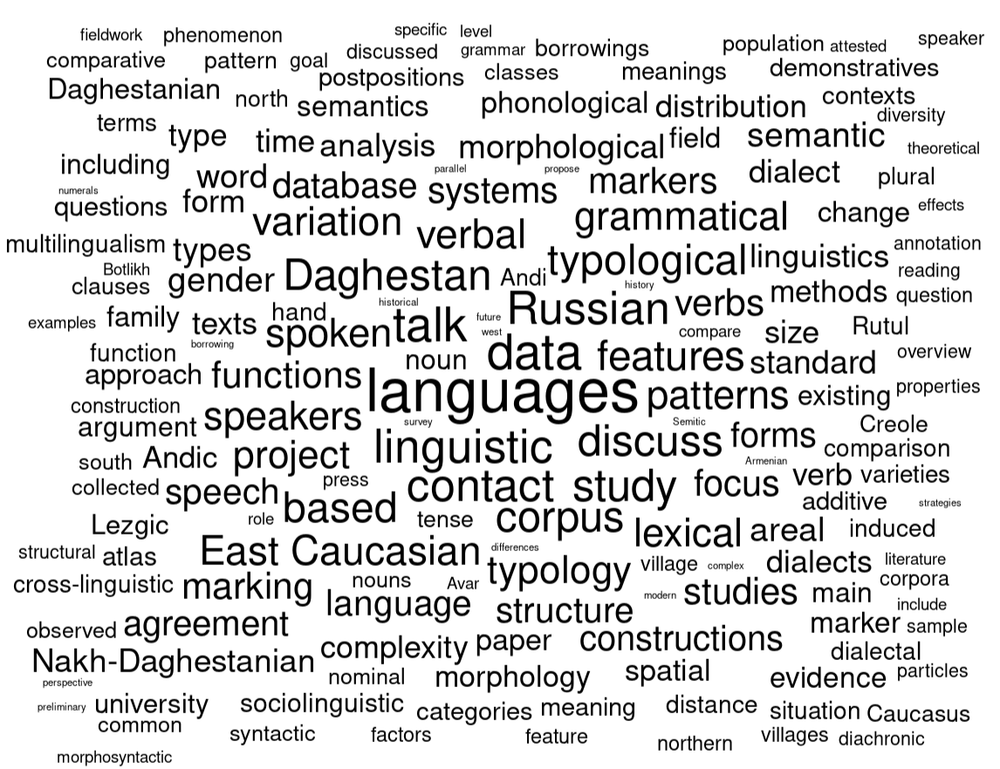

```{r, include=FALSE}
knitr::opts_chunk$set(echo = FALSE, warning = FALSE, message = FALSE, dev='cairo_pdf', fig.align='center', fig.show='hold', out.width="100%")
# setwd("/home/agricolamz/work/materials/2023.06.27_200-th_seminar_talk")
library(tidyverse)
library(tidytext)
library(stopwords)
library(ggwordcloud)
theme_set(theme_minimal()+theme(text = element_text(size = 20), legend.position = "bottom"))
df <- readxl::read_xlsx("data/data.xlsx")
Sys.setlocale("LC_TIME", "en_US.UTF-8")

map(stopwords::stopwords_getsources()[-c(3, 6, 8)], function(i){
  print(i)
  stopwords::stopwords(language = "en", source = i)}) |> 
  unlist() |>  
  unique() |> 
  sort() ->
  stopwords_en

```

## Dataset

[tinyurl.com/2oeaumsa](http://tinyurl.com/2oeaumsa) --- link to the `.xlsx` file with the following columns:

- year
- month
- day
- author
- title
- abstract

Thanks to V. Zhigulskaya, E. Sokur, O. Stogova and A. Russkih for updatings the website. Thanks to A. Alekseeva for helping in parsing data.

## Talk frequency

```{r}
df |> 
  mutate(date = lubridate::make_date(year = 2020, month = month, day = day)) |> 
  ggplot(aes(date))+
  geom_dotplot(dotsize = 0.25)+
  facet_wrap(~year, ncol = 1)+
  labs(x = "", y = "")+
  theme(axis.text.y = element_blank())+
  scale_x_date(date_labels = "%B")
```

## Talk frequency

Unfortunately, on 22-th of June I discovered that 16 talks are missing, so...

\pause

... today is not 200-th seminar.

## The 200-th talk has been given by Michael Daniel

```{r}
df |> 
  mutate(date = lubridate::make_date(year = 2020, month = month, day = day)) |> 
  ggplot(aes(date))+
  geom_dotplot(dotsize = 0.25)+
  geom_dotplot(dotsize = 0.25, data = tibble(date = lubridate::make_date(year = 2020, month = 4, day = 4), year = 2023), fill = "red", color = "red")+
  facet_wrap(~year, ncol = 1)+
  labs(x = "", y = "")+
  theme(axis.text.y = element_blank())+
  scale_x_date(date_labels = "%B")
```

## Talks by author

```{r}
df |> 
  mutate(author = str_remove_all(author, "\\(.*?\\)"),
         author = str_split(author, ", ")) |> 
  unnest_longer(author) |> 
  mutate(author = str_squish(author)) |> 
  count(author, sort = TRUE) ->
  by_author

by_author |> 
  filter(n > 1) |>
  mutate(author = fct_reorder(author, n)) |> 
  ggplot(aes(n, author, label = n))+
  geom_col()+
  geom_text(nudge_x = 0.3)+
  labs(x = "", y = "")+
  theme(text = element_text(size = 15))
```

`r by_author |> filter(n == 1) |> nrow()` authors participated just once.

## What our seminar is about?

```{r, eval = FALSE}
df |> 
  mutate(abstract = str_replace_all(str_c(title, " ", abstract), "Nakh-Daghestanian", "Nakh_Daghestanian"),
         abstract = str_replace_all(abstract, "cross-linguistic", "cross_linguistic"),
         abstract = str_replace_all(abstract, "East Caucasian", "East_Caucasian"),
         abstract = str_replace_all(abstract, "West Caucasian", "West_Caucasian"),
         abstract = str_replace_all(abstract, "East-Caucasian", "East_Caucasian"),
         abstract = str_replace_all(abstract, "West-Caucasian", "West_Caucasian"),
         abstract = str_replace_all(abstract, "Dagestan", "Daghestan"),
         abstract = str_replace_all(abstract, "language", "languages"),
         abstract = str_replace_all(abstract, "languagess", "languages")) |> 
  unnest_tokens(input = "abstract", output = "word") |> 
  count(word, sort = TRUE) |> 
  anti_join(tibble(word = stopwords_en)) |> 
  filter(str_detect(word, "[A-z]"),
         !(word %in% c("e.g", "eds", "https", "oxford", "university")),
         n > 15) |> 
  mutate(word = case_when(word == "east_caucasian" ~ "East Caucasian",
                          word == "caucasus" ~ "Caucasus",
                          word == "daghestan" ~ "Daghestan",
                          word == "daghestanian" ~ "Daghestanian",
                          word == "nakh_daghestanian" ~ "Nakh-Daghestanian",
                          word == "cross_linguistic" ~ "cross-linguistic",
                          word == "russian" ~ "Russian",
                          word == "rutul" ~ "Rutul",
                          word == "avar" ~ "Avar",
                          word == "creole" ~ "Creole",
                          word == "armenian" ~ "Armenian",
                          word == "andic" ~ "Andic",
                          word == "lezgic" ~ "Lezgic",
                          word == "andi" ~ "Andi",
                          word == "semitic" ~ "Semitic",
                          word == "botlikh" ~ "Botlikh",
                          TRUE ~ word),
         n = log(n)) |> 
  ggplot(aes(label = word, size = n))+
  geom_text_wordcloud(rm_outside = FALSE, seed = 42, shape = "square", grid_margin = 2) +
  theme_minimal()
```

```{r}

```


## {}

\LARGE Happy 200-th seminar talk celebration!

\pause

After 28 more seminars it will be 200-th seminar!